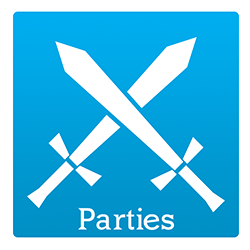
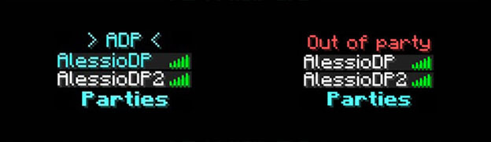

  
  
  
  

# Parties
<b>Parties</b> is a plugin for Minecraft servers that allows the creation of parties, or groups of people, on your server.

[Read more about Parties here!](../../wiki/About-Parties)

 

## Features
| Party Features | Additional Features | External Features |
|---|---|---|
|Customizable ranks                 |Works with Bungeecord                |UUID support|
|Party chat                         |Tag system                           |ProtocolLib support|
|Invite with cooldown               |Colorized tab list                   |PlaceholderAPI support|
|Prevent friendly fire              |Kills system                         |BanManager support|
|Party description                  |Password system                      |SkillAPI support|
|Party prefix/suffix                |Divide EXP system                    |API system|
|Party home                         |Hide commands without permissions    |JSON support|
|Party teleport to the leader       |Follow party in servers/worlds       |Statistics system|
|Party color customizable           |Auto use the command of the leader   |Gravity updater|
|Optional limits for members/names  |Tab complete support                 |YAML and MySQL database|
|Create empty parties (called fixed)|Log system                           ||
|Party delete/rename                |Every command/message is configurable||

 

## Downloads
### [Spigot page](https://www.spigotmc.org/resources/parties.3709/)
### [Bukkit page](https://dev.bukkit.org/projects/parties)

 

## Wiki
Parties offers a great wiki to help you to configure Parties. **[You can find the wiki here!](../../wiki/)**

 

## Plugins Supported
You can find the entire list of the plugins supported by Parties **[here](../../wiki/Supported-plugins)**!

 

## Screenshots
 
*A screenshot of help pages*

 

 
*A screenshot of the tablist, with tablist support*
