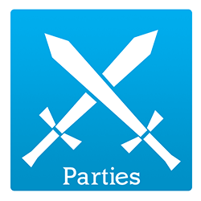

# Parties
<b>Parties</b> is an advanced plugin for Minecraft servers that allows the creation of parties (groups/clans/guilds) on your server.
Everything is configurable and modular, if you don't want a feature, just disable it (it won't have a bad impact on the server).

[Official project page here!](https://alessiodp.com/parties/)

## Downloads
[Download from Spigot](https://www.spigotmc.org/resources/parties.3709/)  
[Download from Bukkit](https://dev.bukkit.org/projects/parties)

## Documentation
[Documentation page here](https://alessiodp.com/docs/parties/).

## License
[Read the license here](https://github.com/AlessioDP/Parties/blob/master/LICENSE).